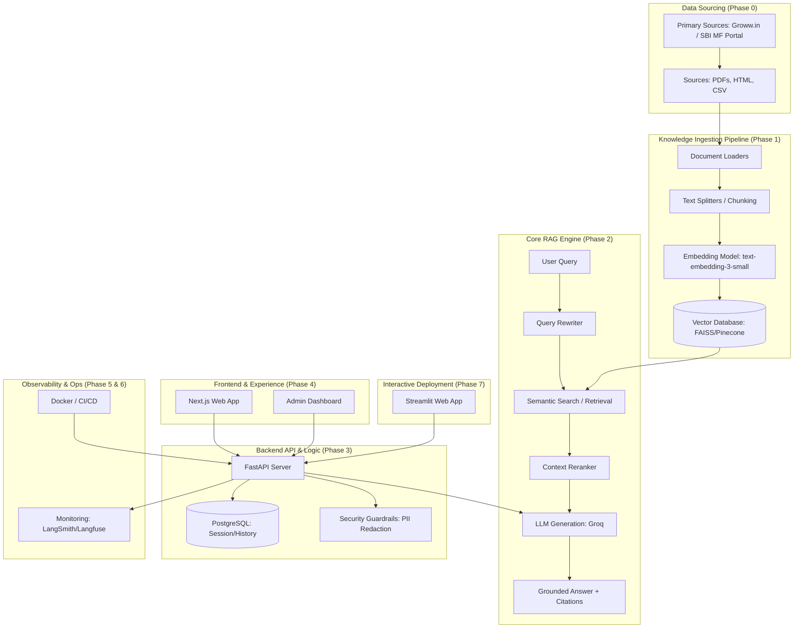

# Phase-Wise Architecture Blueprint: SBI Mutual Fund FAQ Chatbot

This document details the architectural evolution of the SBI Mutual Fund AI Chatbot, spanning from data ingestion to production-scale deployment.

---

## High-Level System Architecture

---

## Phase 0: Data Sourcing & Scoping (Restricted)
**Focus**: Identifying and cataloging the **exclusive** data sources for ingestion.

- **Mandatory Target URLs**: The project scope is strictly limited to the following 9 SBI Mutual Fund products. No other URLs or external sources are to be processed:
  - [SBI Gold Fund](https://groww.in/mutual-funds/sbi-gold-fund-direct-growth)
  - [SBI PSU Fund](https://groww.in/mutual-funds/sbi-psu-fund-direct-growth)
  - [SBI Contra Fund](https://groww.in/mutual-funds/sbi-contra-fund-direct-growth)
  - [SBI Small & Midcap Fund](https://groww.in/mutual-funds/sbi-small-midcap-fund-direct-growth)
  - [SBI Magnum Multiplier Fund](https://groww.in/mutual-funds/sbi-magnum-multiplier-fund-direct-growth)
  - [SBI Nifty Next 50 Index Fund](https://groww.in/mutual-funds/sbi-nifty-next-50-index-fund-direct-growth)
  - [SBI Large Cap Fund](https://groww.in/mutual-funds/sbi-large-cap-direct-plan-growth)
  - [SBI Pharma Fund](https://groww.in/mutual-funds/sbi-pharma-fund-direct-growth)
  - [SBI Silver ETF FoF](https://groww.in/mutual-funds/sbi-silver-etf-fof-direct-growth)
- **Scraping Strategy**: Implement custom selectors for Groww.in to extract Fund Objective, NAV, Expense Ratio, and Riskometer data.

---

## Phase 1: Ingestion & Knowledge Base Construction
**Focus**: Transforming unstructured financial data into a searchable semantic index.

### Subphase 1.1: Data Acquisition & Validation
- **Web Scraping**: Execute the Phase 0 scrapers to pull live data from Groww.in.
- **Content Cleaning**: Strip HTML boilerplate, navigation menus, and footers to keep only core fund data.

### Subphase 1.2: Document Transformation & Chunking
- **Text Standardization**: Convert all scraped data into a unified LangChain `Document` format by concatenating structured fields (Fund Name, NAV, Objective, Risk).
- **Document-Level Embedding**: Since the current scraped data consists of short, structured key-value pairs per fund, bypass recursive chunking and embed the entire fund profile as a single document to preserve context.

### Subphase 1.3: Vector Embedding Generation
- **Model Selection**: Initialize `BAAI/bge-small-en-v1.5` via HuggingFace. This lightweight, open-source model is highly optimized for retrieval and perfectly suited for the short, structured fund profiles.
- **Batch Processing**: Generate local embeddings (384 dimensions) for all document chunks in optimized batches, eliminating API latency and costs.

### Subphase 1.4: Vector Store Indexing
- **Index Initialization**: Setup **FAISS** index for high-speed local retrieval.
- **Metadata Tagging**: Ensure every vector is tagged with relevant data points from the scraper, such as `url`, `fund_name`, `risk`, and `version`.

### Subphase 1.5: Automated Data Refresh & Freshness
- **GitHub Actions Scheduler**: Deploy a GitHub Actions workflow (`.github/workflows/ingestion_cron.yml`) to trigger the entire Phase 1 ingestion pipeline on a recurring schedule (e.g., daily at market close).
- **Real-Time Knowledge Updates**: Ensure the system always retrieves the latest NAVs and fund objectives from live sources, maintaining high "data freshness" for the RAG engine.
- **Automated Re-indexing**: The workflow handles the end-to-end process: Scrape -> Chunk -> Embed -> Index Update, ensuring zero manual intervention for knowledge base maintenance.

---

## Phase 2: Advanced Retrieval Strategy
**Focus**: Retrieving the most relevant context using hybrid techniques.

- **Pre-Retrieval Self-Querying**: Extract exact metadata filters from the user query before searching.
- **Metadata-Filtered Hybrid Retrieval**: Combine FAISS (semantic) with BM25 (keyword) search, strictly applying metadata filters.
- **Low Top-K Strategy**: Retrieve only `k=1` or `k=2` chunks to minimize context noise.

---

## Phase 3: LLM Generation (Groq) & Backend API
**Focus**: Generating grounded answers and building a secure middleware.

- **Answer Generator (Groq)**: Utilize **Groq (Llama 3)** for ultra-low latency response generation. Enforce "Strict Grounding" prompts where the LLM must refuse to answer if the filtered context does not contain the answer.

- **API Framework**: **FastAPI** with asynchronous handlers for sub-3-second P95 latency.
- **Null-Citation & Safety Boundary**: If the RAG engine cannot answer the query (fallback to "I don't know"), the API must strictly omit any source URLs to prevent misleading citations. The API also drops/rejects requests containing unwanted Personal Identifiable Information (PII).
- **Session Management**: PostgreSQL backend to store chat history, allowing for multi-turn dialogues and context retention.
- **Identity & Access**: Implement JWT-based authentication for the Admin Panel and rate-limiting for the public API.
- **Knowledge Refresh API**: Endpoint to trigger incremental re-indexing when new documents are uploaded.

---

## Phase 4: UI/UX & Administrative Tools
**Focus**: Delivering a premium, "wow" factor interface for investors and admins.

- **Modern Chat UI**: Build with **Next.js 14**, featuring streaming responses (Typewriter effect), markdown rendering, and interactive citation chips.
- **Responsive Design**: Mobile-first approach using Tailwind CSS for investors on the go.
- **Admin Dashboard**: A control center to upload documents, view real-time query analytics, and manually correct "hallucination" reports.
- **Bilingual Pilot**: Integrated toggle for English and Hindi (Transliteration/Translation layer).

---

## Phase 5: Security, Compliance & Guardrails
**Focus**: Ensuring the chatbot adheres to SEBI guidelines and data privacy standards.

- **PII Masking**: Integrated layer to detect and redact sensitive info (PAN, Phone numbers) before it reaches the LLM.
- **Factuality Guardrails**: Automated checks (using G-Eval or similar) to compare the LLM output against the retrieved context for hallucination detection.
- **Compliance Filter**: A regex/LLM-based filter to prevent the bot from giving direct financial advice (e.g., "Buy this fund now").

---

## Phase 6: Evaluation, Scaling & CI/CD
**Focus**: Performance benchmarking and production-ready deployment.

- **RAG Evaluation**: Use **RAGAS** to measure Faithfulness, Answer Relevance, and Context Precision.
- **Containerization**: Full stack orchestration using **Docker Compose** for consistent dev/prod environments.
- **Cloud Infrastructure**: Deploy on **AWS (ECS/Fargate)** or **Azure** with auto-scaling groups.
- **Monitoring**: Real-time tracing of LLM calls using **LangSmith** or **Langfuse** to identify bottlenecks and optimize costs.
- **CI/CD & Automation**: Utilize **GitHub Actions** for:
  - **Application CI/CD**: Automated testing and deployment to cloud environments.
  - **Scheduled Ingestion**: Using `workflow_dispatch` and `schedule` triggers to keep the FAISS index and BM25 store updated with the latest data (as defined in Subphase 1.5).

---

## Phase 7: Streamlit Deployment & Interactive Playground
**Focus**: Rapid prototyping and user-friendly testing via Streamlit.

- **Streamlit Playground**: Develop a lightweight, fully functional frontend in Streamlit to serve as a fast testing sandbox. It offers:
  - Chat interface connected to the FastAPI backend or directly calling the Phase 2/3 RAG engine.
  - Interactive parameter controls (e.g., Temperature, Top-K, Retrieval strategy switches) to tweak LLM output in real-time.
  - Context visualization showing the exact retrieved chunks, metadata filters, and similarity scores.
- **Easy Sharing & Deployment**: Host the Streamlit application on **Streamlit Community Cloud** or containerize it for local and cloud deployment, providing stakeholders with an immediate, interactive way to test the RAG engine's performance.

---

*Document Version: 1.1 | Created for SBI Mutual Fund LIP3 Project*
